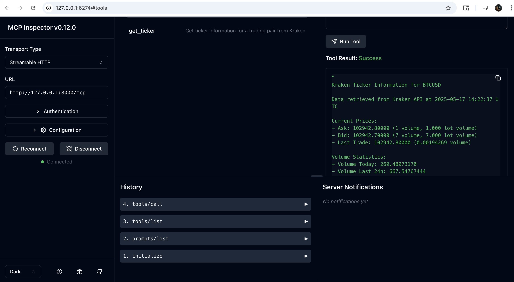

# Kraken Ticker MCP

> **Important Note**: This project is intended as a "Hello World" educational example to learn the Model Context Protocol (MCP). It was created for educational purposes only and is not production-ready. Use in production environments is not recommended.

## Credit and References

This implementation was developed according to the following specifications and resources:

- [**Model Context Protocol (MCP) Specification**] (https://modelcontextprotocol.io/specification/) - The official protocol specification defining the standard interface for tool calling.

- [**MCP Python SDK**](https://github.com/modelcontextprotocol/python-sdk) - The Python implementation of the MCP protocol used in this project.

- This MCP server uses the [Kraken Public API](https://docs.kraken.com/api/docs/rest-api/get-ticker-information) to retrieve ticker information.

- [MCP Sentry Server](https://github.com/modelcontextprotocol/servers/tree/main/src/sentry) - Used as a reference implementation during early development.

## Overview

Kraken Ticker MCP is a Model Context Protocol (MCP) server for retrieving real-time ticker information from the Kraken cryptocurrency exchange API. This server provides tools for AI assistants to access up-to-date market data for various cryptocurrency trading pairs.

### Tools

1. `get_ticker`
   - Retrieve ticker information for a specific trading pair
   - Input:
     - `pair` (string): Trading pair symbol (e.g., "BTCUSD", "ETHUSD")
   - Returns: Detailed ticker information including:
     - Ask price and volume
     - Bid price and volume
     - Last trade price and volume
     - Volume statistics (today and last 24 hours)
     - Volume weighted average price
     - Number of trades
     - Low and high prices
     - Opening price

### Prompts

1. `kraken-ticker`
   - Retrieve ticker information from Kraken
   - Input:
     - `pair` (string): Trading pair symbol (e.g., "BTCUSD", "ETHUSD")
   - Returns: Formatted ticker details as conversation context

## Quickstart

The recommended way to use Kraken Ticker MCP is through Docker containerization. This provides a consistent environment and simplifies deployment.

```bash
# Clone the repository
git clone https://github.com/your-username/kraken-ticker-mcp.git
cd kraken-ticker-mcp

# Build the Docker image
docker build -t kraken-ticker-mcp .

# Run the container with port forwarding
docker run -d -p 8000:8000 --name kraken-mcp-server kraken-ticker-mcp

# Check that the container is running
docker ps | grep kraken-mcp-server
```

That's it! Your MCP server is now running with streamable HTTP transport on port 8000, ready to be accessed at `http://localhost:8000/mcp`.

## Connecting with MCP Inspector

The easiest way to test the server is using the MCP Inspector tool:

```bash
# Launch the MCP Inspector
npx @modelcontextprotocol/inspector
```

Then:
1. Browse to http://127.0.0.1:6274/
2. Connect to http://127.0.0.1:8000/mcp
3. Use the `get_ticker` tool with a cryptocurrency pair like "BTCUSD"



### Command Line Options

The server supports the following command line options:

```bash
# Show help
python -m mcp_server_kraken --help

# Available options:
--transport [stdio|streamable-http]  # Transport protocol (default: streamable-http)
--host TEXT                          # Host for HTTP transport (default: localhost)
--port INTEGER                       # Port for HTTP transport (default: 8000)
--stateless                          # Run in stateless mode for better scalability
```

## Untested Methods

The following integration methods are provided but have not been verified in the current implementation:

| Client | Transport | Configuration Method | Status |
|--------|-----------|----------------------|--------|
| Claude Desktop | stdio | `claude_desktop_config.json` | Untested |
| VS Code | stdio | User Settings (JSON) | Untested |
| Windsurf | streamable-http | `mcp_config.json` | Untested |
| Custom MCP Clients | streamable-http | Connect to http://localhost:8000/mcp | Untested |

## License

```
MIT License

Copyright (c) 2025 Kraken Ticker MCP Contributors

Permission is hereby granted, free of charge, to any person obtaining a copy
of this software and associated documentation files (the "Software"), to deal
in the Software without restriction, including without limitation the rights
to use, copy, modify, merge, publish, distribute, sublicense, and/or sell
copies of the Software, and to permit persons to whom the Software is
furnished to do so, subject to the following conditions:

The above copyright notice and this permission notice shall be included in all
copies or substantial portions of the Software.

THE SOFTWARE IS PROVIDED "AS IS", WITHOUT WARRANTY OF ANY KIND, EXPRESS OR
IMPLIED, INCLUDING BUT NOT LIMITED TO THE WARRANTIES OF MERCHANTABILITY,
FITNESS FOR A PARTICULAR PURPOSE AND NONINFRINGEMENT. IN NO EVENT SHALL THE
AUTHORS OR COPYRIGHT HOLDERS BE LIABLE FOR ANY CLAIM, DAMAGES OR OTHER
LIABILITY, WHETHER IN AN ACTION OF CONTRACT, TORT OR OTHERWISE, ARISING FROM,
OUT OF OR IN CONNECTION WITH THE SOFTWARE OR THE USE OR OTHER DEALINGS IN THE
SOFTWARE.
```

## Security Policy

If you discover a security vulnerability, privacy concern, or bug, please report it to:

fixit [dot] github [at] attentiontransformer [dot] com

Issues will be addressed on a best-effort basis. We appreciate your help in making this project more secure.

Contributions and suggestions are welcome!
